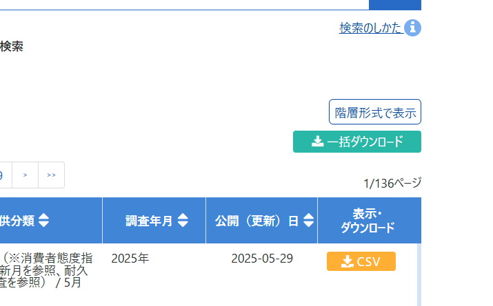
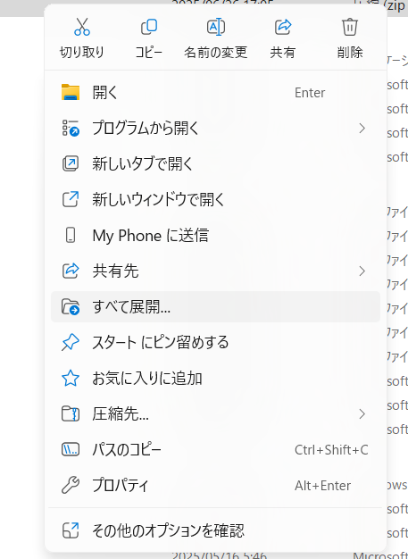
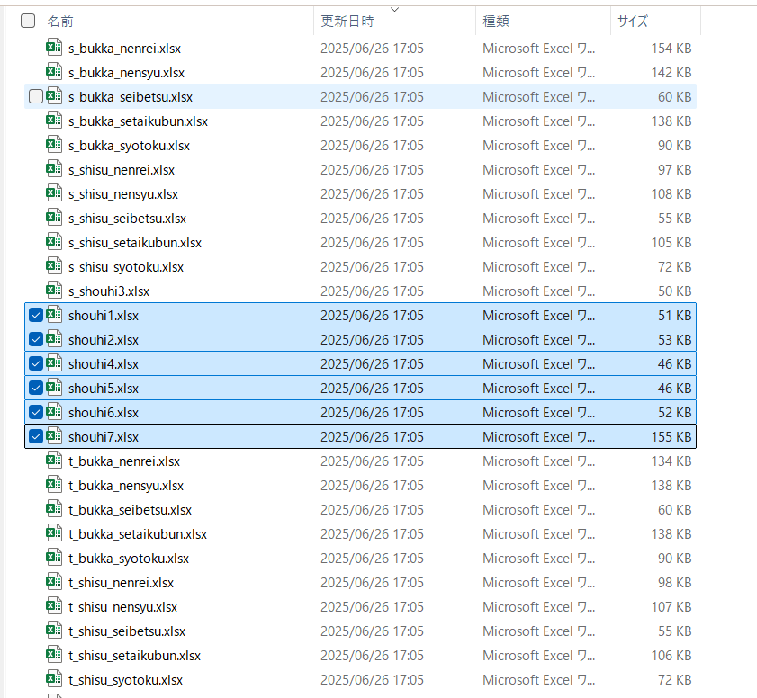

# データ分析

汎用的なPromptです。分析したいビジネス上の仮説や、分析したい項目、例えば日付だったり、顧客の属性別、などあれば、それは具体的に指定した方がいいです。

- 分析対象のデータがある場合は、この「手順」はスキップします。

# Deep Research 用

Microsoft 365 Copilot のAnalystなどを使って、構造化データの分析を行うためのPromptです。

```cmd
このデータセットで論理的かつ詳細な分析・解析を行ってください。
特に知りたい事は、{項目名・列名など}が増えているかどうか、です。
```

# 一般的なモデル (GPT-4やo3, o4など)用

このテキストはPrompt-ZoomItのDemoType用に複数回のPromptを含んでいます。
Microsoft 365 Copilotを使う場合は、分析対象としたいファイルをアップロード後に、以下のPromptを入力してください。
ファイルの数は、サイズに制限はありますので、大量のファイルを扱いたい際にはご注意ください。

```cmd
このデータセットを、{ガイドライン}を参考にして、詳細な分析・解析を行ってください。
分析・解析した結果を、論理的で説得力のある説明できるようになるための補足説明も作成してください。
グラフや表を用いて、視覚的にわかりやすくしてください。

### ガイドライン
その目的や分析の深さによって大きく分類できます。一般的には以下の4つのカテゴリに分けられ、それぞれに典型的な手法があります。
- 記述的分析（Descriptive Analytics）:「何が起こったか」を明らかにする基本的な分析手法です。データの集計や平均・分散などの統計量算出、可視化（グラフ化）による現状の把握などが該当します。ビジネスインテリジェンス(BI)ツールやダッシュボードを用いて、売上や顧客数などの指標をレポートするのが典型例です。記述的分析によりデータの傾向や分布を把握できます。
- 診断的分析（Diagnostic Analytics） :「なぜそれが起こったのか」を特定するための分析です。記述的分析で見えた変化や問題に対し、その要因や原因を深掘りします。具体的には、相関分析やドリルダウン分析、仮説検証、プロセスマイニングなどの手法が使われます。例えばプロセスマイニングではシステムのログデータを解析して業務フロー上のボトルネックを発見できます。
- 予測的分析（Predictive Analytics） : 過去データを基に未来を予測する分析です1。統計的な予測モデルや機械学習アルゴリズムを用いて、将来の数値や事象を見積もります。代表的な手法には回帰分析（売上と広告費など変数間の関係性から将来を予測）や時系列分析（時間軸に沿ったデータからトレンドや季節性を予測）、分類・クラスタリング（顧客や事例をグループ化し将来の行動を予測）などがあります。例えば売上予測モデルや顧客離反予測モデルの構築がこれに当たります。
- 処方的分析（Prescriptive Analytics） : 予測結果に基づいて最適な行動を提案する分析です。予測で得られた将来像に対し、望ましい結果を得るには何をすべきか、複数の選択肢の中で最善策はどれかを導きます。最適化アルゴリズム（例：線形計画法によるリソース配分最適化）やシミュレーション（様々なシナリオを仮想実験して結果を比較）など高度な手法が用いられます。例えば在庫管理では需要予測(予測的分析)に基づき、在庫量と発注タイミングを最適化する計算を行います。また交通や製造分野で注目されるデジタルツイン技術も処方的分析に活用され、現実世界のモデルを用いて最適な意思決定を支援します。

以上の分析手法は階層的・補完的な関係にあり、組み合わせて活用することでより深い洞察が得られます。例えば、まず記述的分析で現状を把握し、診断的分析で原因を究明、その上で予測モデルを作って未来を見通し、処方的分析で具体的な施策を立案する、といった流れです。企業の分析力成熟度に応じて、基本的な分析から高度な分析へ段階的に取り組むのが一般的です。
```

作業が途中で止まった場合は、以下のPromptを入力して、続きを実行してください。

```cmd
作業を続けてください。
```

同じチャットスレッドで。Reasoning Model系で以下のPromptで補足資料の作成をしてもらってもいいかもしれません。

Prompt:
```cmd
作成した分析レポートを論理的で説得力のある説明できるようになるための補足資料も作成してください。
```

## (オプション) サンプルとしての消費動向調査データの入手手順
もし、対象となるデータセットが無い場合は、政府統計の e-Stat から「消費動向調査」のデータをダウンロードして、分析に利用してください。


このデータはデータの分析で処理しやすい形式にはなっていません。できればデータ加工をしてから行った方が良いです。

ですが、この状態でもある程度は動作しますので、是非試してみてください。

- **e-Stat**のウェブサイトにアクセスします。

    URL:

    https://www.e-stat.go.jp/stat-search/files?page=1&layout=dataset&toukei=00100405&tstat=000001014549&metadata=1&data=1

- 画面右上の**一括ダウンロード**ボタンを押して、**Excel**形式でダウンロードします




- 複数のファイルがzip圧縮されて1つのファイルになっています。**展開**メニューで個々のファイルを扱えるようにします。



- 解凍したフォルダの中にある**同じファイル名で始まっている**複数のファイルを使います。例えば「shohi1.xls」「shohi2.xls」などです。    



